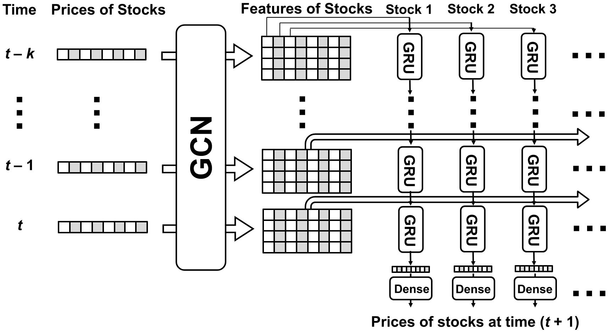

# Forecasting Stock Prices Using Stock Correlation Graph
We create a new modle by combining GCN model with GRU model and achieve around 5% incraese in accuracy in comparison to baseline model.

# Published Paper
## [Forecasting Stock Prices Using Stock Correlation Graph: A Graph Convolutional Network Approach](https://github.com/troyyxk/GCGRU_STOCK_PREDICTION/tree/main/published_paper)

# Paper Citation
X. Yin, D. Yan, A. Almudaifer, S. Yan and Y. Zhou, "Forecasting Stock Prices Using Stock Correlation Graph: A Graph Convolutional Network Approach," 2021 International Joint Conference on Neural Networks (IJCNN), 2021, pp. 1-8, doi: 10.1109/IJCNN52387.2021.9533510.

# Link to the Paper
```
https://ieeexplore.ieee.org/document/9533510
```

## Model Architecture


## Illustration of Graph Convolution


## Dependencies
  * Tensorflow
  * Pandas
  * Numpy
  * Sklearn
  * Configparser
  
## Workflow
The workflow is utralize. Start training the model by simply run:
```
python3 train.py
```

Hyper parameters can be changed at the file 

```
config.ini
```
### Hyper Parameter

| Hyper Parameter        | Definition           |
| ------------- |:-------------:|
| data_addr        | The address for the data(stock prices) in use |
| adj_addr       | The address for the adjcency matrix in use |
| s_index       | The index of stock to predict |
| lr       | Learning rate |
| n_neurons       | Number of neurons in GRU layer |
| seq_len       | Sequence length |
| n_epochs       | Number of epochs |
| batch_size       | Batch size      |
| th | Threshold for ε-insensitive accuracy      |

### Data Address
The form of data is address is compose of several parts 

``./data/data/[dataset]/[dataset]_[time duration]_price.csv``

For in stance:

``./data/data/dow/dow_1day_price.csv``

### Adjacency Matrix Address
The form of data is address is compose of several parts 

``./data/adj/[dataset]/[time duration]/[dataset]_[time duration]_[cut off]_01_price.csv``

For in stance:

``./data/adj/dow/1day/dow_1day_090_01_corr.csv``


*** ``[dataset]`` and ``[time duration]`` must be the same for both data address and adjacency matrix address


## Directory Structure

```
gcgru_stock_prediction
├── config.ini
├── gcgru.py
├── input_data.py
├── train.py
├── utils.py
├── image
│   ├── gcc.jpeg
│   └── model.jpeg
└── data
    ├── adj
    │   ├── dow
    │   │   ├── 1day
    │   │   │   ├── dow_1day_050_01_corr.csv
    │   │   │   ├── dow_1day_055_01_corr.csv
    │   │   │   └── ...
    │   │   └── ...
    │   └── etf
    │       ├── 1day
    │       │   ├── etf_1day_050_01_corr.csv
    │       │   ├── etf_1day_055_01_corr.csv
    │       │   └── ...
    │       └── ...
    └── data
        ├── dow
        |   ├── dow_10min_price.csv
        |   ├── dow_15min_price.csv
        |   ├── dow_1day_price.csv
        |   ├── dow_1h_price.csv
        |   └── dow_30min_price.csv
        └── etf
            ├── etf_15min_price.csv
            ├── etf_1day_price.csv
            ├── etf_1h_price.csv
            └── etf_30min_price.csv
```
